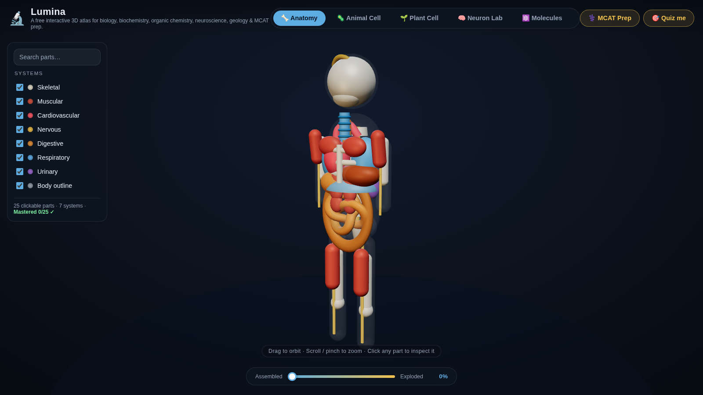
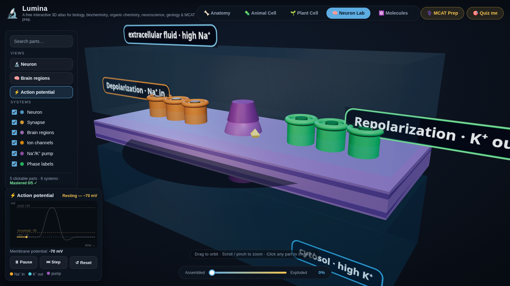
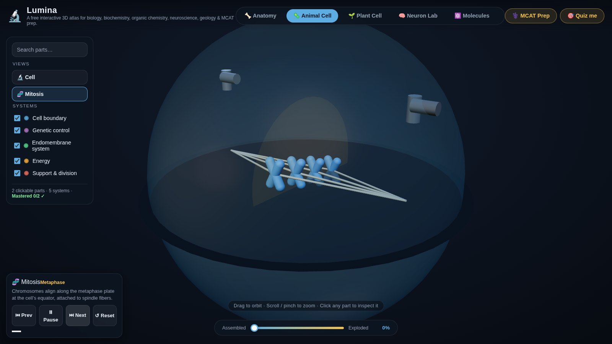
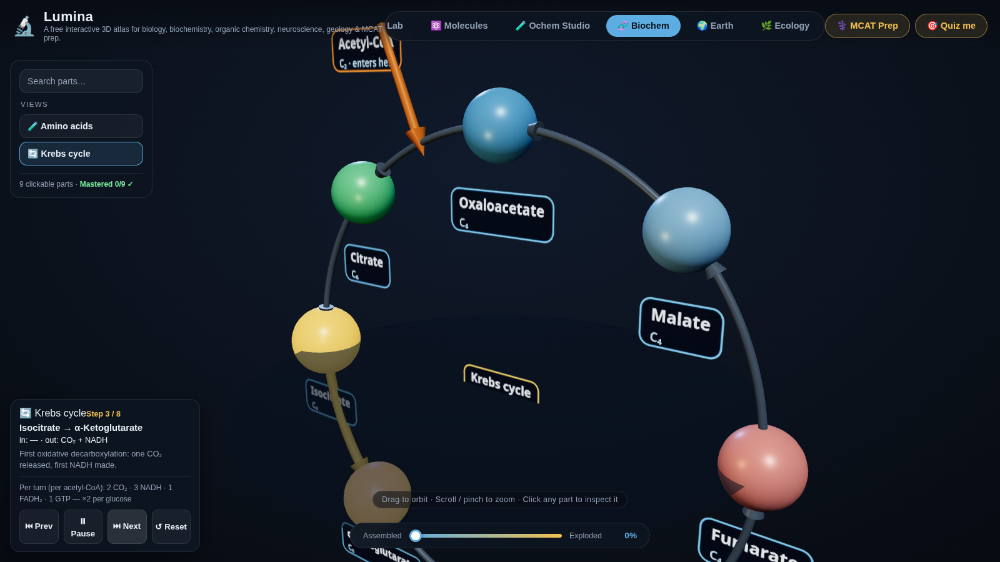
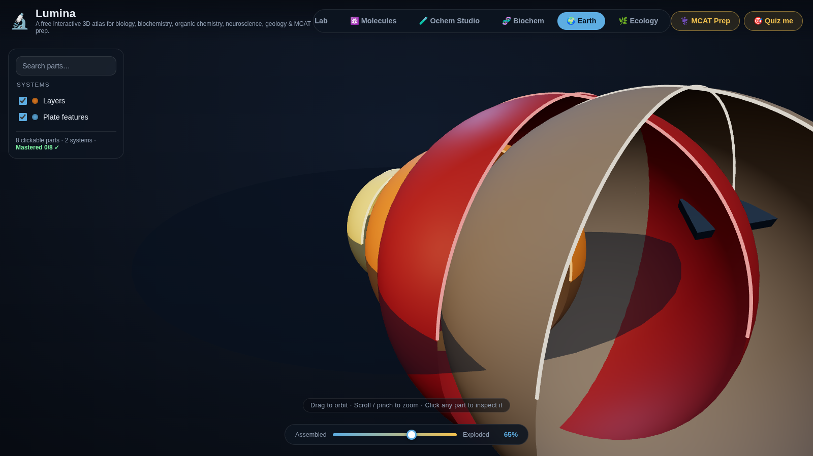
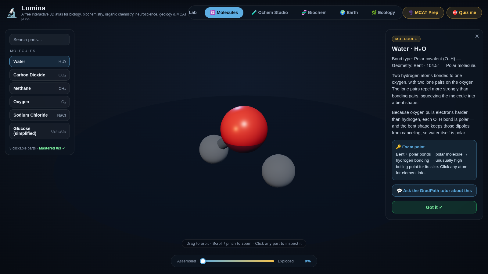

# 🔬 Lumina

[](https://divya-racha.github.io/lumina/)


### 👉 **[Try Lumina live in your browser — no sign-up, no install](https://divya-racha.github.io/lumina/)**

**Mission:** a free-forever interactive 3D atlas for college students studying medicine and science — built for biology, biochemistry, organic chemistry, neuroscience, geology, and MCAT prep. No accounts, no paywalls, no limits.

## Screenshots

| 🫀 Human Anatomy | ⚡ Action potential |
|---|---|
|  |  |

| 🧬 Mitosis walkthrough | 🔄 Krebs cycle walkthrough |
|---|---|
|  |  |

| 🌍 Earth Explorer (exploded) | ⚛️ Molecules |
|---|---|
|  |  |

## The atlases

Nine interactive 3D atlases:

1. **Human Anatomy** — a stylized procedural figure with 7 toggleable systems (skeletal, muscular, cardiovascular, nervous, digestive, respiratory, urinary), 25 clickable organs and structures, and an explode slider that separates the systems in 3D.
2. **Animal Cell** — two views: the classic cell with 13 clickable organelles inside a translucent membrane (nucleus, nucleolus, mitochondria, RER, SER, Golgi, ribosomes, lysosomes, vacuole, centrioles, cytoskeleton, membrane, cytoplasm) — plus a **🧬 Mitosis** walkthrough with 6 step-through stages (Interphase, Prophase, Metaphase, Anaphase, Telophase, Cytokinesis), Prev/Next/Play/Reset controls, a stage HUD, and clickable chromosomes, spindle fibers, centrioles, nuclear envelope, and cleavage furrow.
3. **Plant Cell** — cell wall, cell membrane, giant central vacuole, chloroplasts with thylakoid hints, plus the shared organelles (nucleus, mitochondria, ER, Golgi, ribosomes).
4. **Neuron Lab** — three views: a full neuron (soma, dendrites, axon hillock, axon, myelin sheath, nodes of Ranvier, axon terminals, synapse close-up with vesicles and cleft), brain regions (cerebrum, cerebellum, brainstem, corpus callosum, thalamus, hypothalamus), and an animated **⚡ Action potential** view — clickable Na⁺/K⁺ channels and the Na⁺/K⁺ pump, Play/Pause/Step/Reset controls, ions visibly flowing across the membrane, and a synchronized voltage-vs-time graph with a live mV readout.
5. **Molecules** — six switchable ball-and-stick models with correct VSEPR geometry (bent H₂O at 104.5°, linear CO₂, tetrahedral CH₄ at 109.5°), an NaCl ionic lattice, and a simplified glucose ring. Click any atom for element info (name, atomic number, exam fact).
6. **Ochem Studio** — two views: a functional-group explorer (hydroxyl, aldehyde, ketone, carboxyl, amino, phosphate, sulfhydryl, methyl — quiz asks "click the hydroxyl group") and a molecule gallery (ethanol, benzene, simplified aspirin and caffeine).
7. **Biochem Corner** — two views: all 20 amino acids, grouped nonpolar / polar / acidic / basic, each built on demand in 3D (amino group, α-carbon, carboxyl group, side chain) with 1-letter/3-letter codes and exam points (disulfide bridges, helix-breakers, phosphorylation sites…) — plus a **🔄 Krebs cycle** walkthrough: 8 steps around the cycle with per-step inputs/outputs and totals per acetyl-CoA (2 CO₂, 3 NADH, 1 FADH₂, 1 GTP), Prev/Next/Play/Reset controls, and clickable step nodes.
8. **Earth Explorer** — cutaway concentric layers (inner core, outer core, mantle, crust) plus tectonic plates, a mid-ocean ridge, and a subduction trench. Explode pulls the layers apart.
9. **Ecology** — an interactive 3D food web across trophic levels with energy-flow arrows and decomposers, plus a biome selector (desert, rainforest, tundra, ocean) with biome fact cards.

Every study card carries a plain-English description plus a "🔑 Exam point" distilled from open textbook content (OpenStax Biology 2e and Chemistry 2e), so the app doubles as an exam-prep tool. Models are stylized classroom visualizations, not medical-grade anatomy.

## The learning loop

- **Animated term reveal** — every part name pops in letter-by-letter when its study card opens, so terms stick.
- **⚡ Quick check** — after you visit any part, a floating chip offers a one-question micro-quiz (click-to-recall in 3D, 3-choice term questions, or element clicks). Always skippable. Correct answers get a confetti burst; wrong ones show you the right part with encouragement.
- **Mastery tracking** — parts you answer correctly (micro-quizzes, quiz rounds, MCAT packs) are marked learned: ✓ badges in search results and a "Mastered X/Y" line per atlas, saved in your browser.
- **🎯 Quiz me** (top bar): 10-question rounds sampled from the current atlas — click the named part in 3D. Green = correct, red = wrong (the right answer flashes green). Score tiers from "Keep exploring 🔍" to "Exam ready 🏆".
- **⚕️ MCAT Prep**: section packs (Bio/Biochem, Chem/Phys) of 10 questions that auto-switch atlases, views, and molecules — like test day. Packs include questions on the action potential, mitosis stages, and Krebs cycle.
- **💬 Ask the GradPath tutor**: every study card links to the [GradPath AI tutor](https://gradpath-727nuzefxhbofh3rmobmk3.streamlit.app/) for deeper questions.

## Run it locally

No build step, no backend. From this folder:

```bash
python3 -m http.server 8000
# then open http://localhost:8000
```

## Controls

- **Drag** to orbit, **scroll / pinch** to zoom
- **Click any structure** to open its study card ("Got it ✓" closes it and arms a quick check)
- **Explode slider** (bottom) separates the systems / organelles / atoms in 3D
- **Left panel**: toggle systems, switch views/molecules/amino acids/biomes, step through animations
- **🔍 Search** (top of left panel): type a part name, pick a result — the camera flies to it and its study card opens
- Mobile: the left panel collapses behind the ☰ button; the study card becomes a bottom sheet

## Tech

- Static HTML/CSS/JS, [Three.js 0.160.0](https://threejs.org/) via CDN import map (no build step)
- All geometry is procedural — no external model files
- Raycasting for click-to-inspect, hover highlighting, per-part explode vectors
- System toggles simply toggle group visibility; explode = `position = basePos + explodeDir × t × factor`
- Quiz, MCAT packs, and micro-quizzes sample from each atlas's own part data — they can't drift out of sync
- No backend, no accounts, no analytics, no API keys — everything runs in the browser

## Files

```
index.html          app shell (import map, panels, explode slider, learn-mode UI)
css/style.css       dark theme, responsive desktop/mobile
js/main.js          scene, controls, picking, panels, explode, MCAT + learn mode
js/quiz.js          quiz sampling, MCAT sections, micro-quiz + mastery logic (pure)
js/anatomy.js       25-part procedural human figure, 7 systems
js/cell.js          13-organelle animal cell + mitosis walkthrough
js/plantcell.js     plant cell: wall, vacuole, chloroplasts
js/neuron.js        neuron + synapse views, brain regions, action potential animation
js/molecules.js     6 switchable molecules/lattices
js/ochem.js         functional groups + ochem molecule gallery
js/biochem.js       20 amino acids, built on demand + Krebs cycle walkthrough
js/earth.js         cutaway Earth layers + plate features
js/ecology.js       3D food web + biome selector
screenshots/        README screenshots (captured from the live site)
```

## Educational grounding

Study-card content is grounded in OpenStax Biology 2e (Ch. 3 biological macromolecules; Ch. 4 cell structure; Ch. 10 cell reproduction; Ch. 34–41 organ systems) and OpenStax Chemistry 2e (Ch. 7 bonding & VSEPR molecular geometry; Ch. 10 solids; Ch. 2 atoms/ions).
